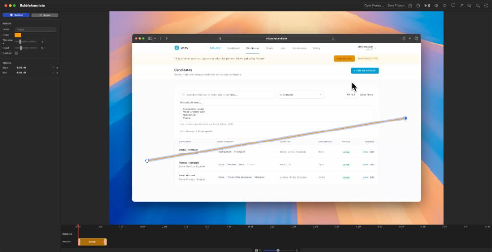

# BubbleAnnotate

A native macOS app for adding speech bubbles and arrows to videos. Built with SwiftUI and AVFoundation.

## Features

- **Speech Bubbles** — Add text bubbles with customisable fonts, colours, borders, corner radius, and opacity
- **Arrows** — Add directional arrows with adjustable thickness, colour, dash style, and arrowhead size
- **Timeline Editor** — Drag, resize, and position annotations on a visual timeline
- **Drag & Resize** — Move and resize all annotations directly on the video overlay
- **Export** — Render annotated videos with all overlays baked in
- **Project Files** — Save and reopen projects to continue editing later
- **Keyboard Shortcuts** — Full keyboard shortcut support for fast workflows

## Download

Download the latest release from the [Releases](https://github.com/urlcv/BubbleAnnotate/releases) page.

- **BubbleAnnotate-1.0-macOS.dmg** — Disk image (mount and drag to Applications)
- **BubbleAnnotate-1.0-macOS.zip** — Compressed archive

### Requirements

- macOS 14.0 (Sonoma) or later
- Apple Silicon or Intel Mac

## Usage

1. Launch the app and click **Import Video** or **Open Project**
2. Use the toolbar buttons or keyboard shortcuts to add bubbles and arrows
3. Double-click a bubble on the video to edit its text, press Return to confirm
4. Drag annotations on the video overlay to reposition them
5. Use the timeline to adjust when annotations appear and for how long
6. Click **Export** to render the final video

### Keyboard Shortcuts

| Shortcut | Action |
|----------|--------|
| ⌘I | Import video |
| ⌘O | Open project |
| ⌘S | Save project |
| ⌘E | Export video |
| ⌘B | Add bubble |
| ⇧⌘A | Add arrow |
| Space | Play / Pause |
| ⌘← | Step back |
| ⌘→ | Step forward |
| Delete | Remove selected annotation |
| + / - | Zoom timeline in/out |

## Building from Source

1. Clone the repository
2. Open `BubbleAnnotate.xcodeproj` in Xcode 15+
3. Build and run (⌘R)

No external dependencies required.

## License

Copyright © 2025 URLCV. All rights reserved.

---

A tool by [URLCV](https://urlcv.com)
